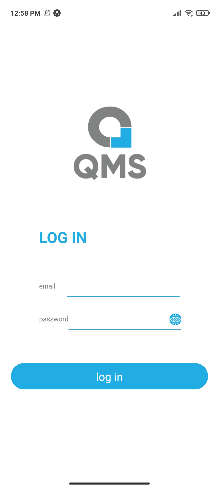

# QMS
Queue management system app build with React Native

<h2>Home page</h2>

<h2>login page</h2>

<h2>register page</h2>

<h2>Compaies list</h2>

<h2>Company services</h2>

<h2>Pick Date</h2>

<h2>Company Branches</h2>

<h2>Filter Branches</h2>

<h2>Queue ticket</h2>

<h2>Push Notificaton</h2>

<h2>Appointments</h2>

<h2>History</h2>

<h2>Settings</h2>

<h2>Profile</h2>

